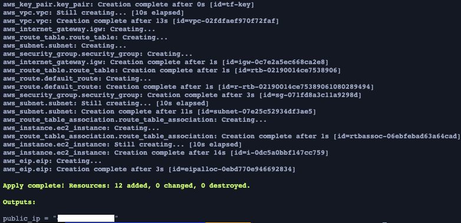
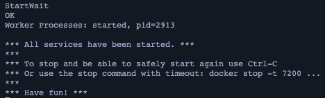

# Documentation

To get started clone the example repository by using the following command:
```bash
git clone --recursive https://github.com/randomstr1ng/tf-sap-automation.git
```
This will include the different modules.

## Terraform Modules
All modules can be found within [modules](./aws/modules) folder.
Below are examples on how the modules can be integrated into exisitng terraform deployments.

- SAPRouter
```terraform
module "saprouter" {
  source = "./modules/saprouter"

  security_group_name = var.srt-security_group_name
  routtab-file-url    = var.routtab-file-url
  ec2_name            = var.saprouter_ec2_name
  vpc-id              = aws_vpc.vpc.id
  keypair-id          = aws_key_pair.key_pair.id
  subnet-id           = aws_subnet.subnet.id
}

# Output
output "saprouter_private_ip" {
  description = "SAPRouter Instance Private IP"
  value = module.saprouter.private_ip
}
```

- SAP Cloud Connector
```terraform
module "sapcloudconnector" {
  source = "./modules/sap-cloud-connector"

  security_group_name = var.scc-security_group_name
  ec2_name            = var.sapcloudconnector_ec2_name
  vpc-id              = aws_vpc.vpc.id
  keypair-id          = aws_key_pair.key_pair.id
  subnet-id           = aws_subnet.subnet.id
  cloud-connector-version         = var.cloud-connector-version
  jvm-version         = var.jvm-version
}

# Output
output "sapcloudconnector_private_ip" {
  description = "SAP Cloud Connector Instance Private IP"
  value = module.sapcloudconnector.private_ip
}
```

- SAP S/4HANA 1909 (ABAP Platform Trial)
```terraform
module "sap-s4hana" {
  source = "./modules/s4-hana"

  security_group_name = var.s4_hana_security_group_name
  ec2_name            = var.s4_hana_ec2_name
  vpc-id              = aws_vpc.vpc.id
  keypair-id          = aws_key_pair.key_pair.id
  subnet-id           = aws_subnet.subnet.id
}

# Output
output "sapcloudconnector_private_ip" {
  description = "SAP S/4HANA Instance Private IP"
  value = module.sap-s4hana.private_ip
}
```

Within the [aws](./aws) folder you can find a example terraform deployment which includes all three modules.

## SAP Cloud Connector

This terraform deployment will setup a OpenSUSE Leap AWS EC2 Instance will allows to run an SAP Cloud Connector. 

### Requirements

- AWS Account with Credentials
- configured AWS profile on the OS level
- terraform

### Deploment

- Add the correpsonding module to your existing terraform code.

- Adjust the variables as needed (e.g. update Cloud Connector version, SAP JWM version, etc)

- Initialize terraform

```bash
terraform init
```

- Apply terraform state

```bash
terraform apply
# automatically approve the deployment
terraform apply --auto-approve
```

- Wait for deployment to finish to retrieve the IP address of the instance
- Login via SSH, using the generated SSH key `ssh_key.pem` to ajust the configuration as needed.

## Usage

Login to SAP Cloud Connector admin interface at https://\<ip-address>:8443

## SAPRouter

This terraform deployment will setup a OpenSUSE Leap AWS EC2 Instance will allows to run an SAPRouter. The routing file can be ajusted via a variable to be customized.

### Requirements

- AWS Account with Credentials
- configured AWS profile on the OS level
- terraform

### Deploment

- Add the correpsonding module to your existing terraform code.

- Adjust the variables as needed (e.g. update saprouttab, etc)

- Initialize terraform

```bash
terraform init
```

- Apply terraform state

```bash
terraform apply
# automatically approve the deployment
terraform apply --auto-approve
```

- Wait for deployment to finish to retrieve the IP address of the instance
- Login via SSH, using the generated SSH key `ssh_key.pem` to ajust the configuration as needed.

### Usage

SAPRouter is running as a systemd service. It can be controled via the `systemctl` command

```bash
# Start SAPRouter
sudo systemctl start saprouter
# Stop SAPRouter
sudo systemctl stop saprouter
# Restart SAPRouter
sudo systemctl restart saprouter
# Status of SAPRouter Service
sudo systemctl status saprouter
```


## SAP S/4 HANA 1909 (ABAP Platform Trial)

The original Instructions and deployment information can be found at [Dockerhub](https://hub.docker.com/r/sapse/abap-platform-trial)

This terraform deployment will setup the SAP ABAP Platform Trial container on a AWS EC2 Instance. In addition, the container will get created automatically und a script is provided wich allows to update/renew the liceses very easy.

### Requirements

- AWS Account with Credentials
- configured AWS profile on the OS level
- terraform

### Deploment

- Add the correpsonding module to your existing terraform code.

- Adjust the variables as needed.

- Initialize terraform

```bash
terraform init
```

- Apply terraform state

```bash
terraform apply
# automaticaly approve the deployment
terraform apply --auto-approve
```

- Wait for deployment to finish to retrieve the IP address of the instance




### Apply Configuration

- Login via SSH, using the generated SSH key `ssh_key.pem`

- Wait until Cloud-Init has finished the deployment. **This can take about 20 min!**
  - check the logfile `/var/log/cloud-init-output.log` for the actual status
- Wait for SAP Docker Container to be started
- Extract the HANA DB and ABAP Platform Hardware keys to generate a license

```bash
# Access the output of the Container to extract the Hardware keys
sudo docker logs -f a4h
```


- Use the `license-sap.py` (location: `/opt/s4-hana-trial/`) to generate the licenses

```bash
# generate the HDB license
$ sudo python3 /opt/s4-hana-trial/license-sap.py --hwkey <Place your Hardware key here> --type hdb
[+] Licensekey written to file: /opt/s4-hana-trial/HDB_license
[+] Done
[+] Please restart your SAP System now to apply the new licensekey

# generate the AS ABAP license
$ sudo python3 /opt/s4-hana-trial/license-sap.py --hwkey <Place your Hardware key here> --type a4h
[+] Licensekey written to file: /opt/s4-hana-trial/ASABAP_license
[+] Done
[+] Please restart your SAP System now to apply the new licensekey
```

- Restart the SAP System to apply the licenses

```bash
sudo docker compose -f /opt/s4-hana-trial/docker-compose.yaml restart
```

- Use the `docker logs` command to check if the SAP System has been started successfull

```bash
sudo docker logs -f a4h
```



- Login via SAP GUI using the Username `Developer` and the Password: `ABAPtr1909`. (More Information: [Dockerhub Page](https://hub.docker.com/r/sapse/abap-platform-trial))